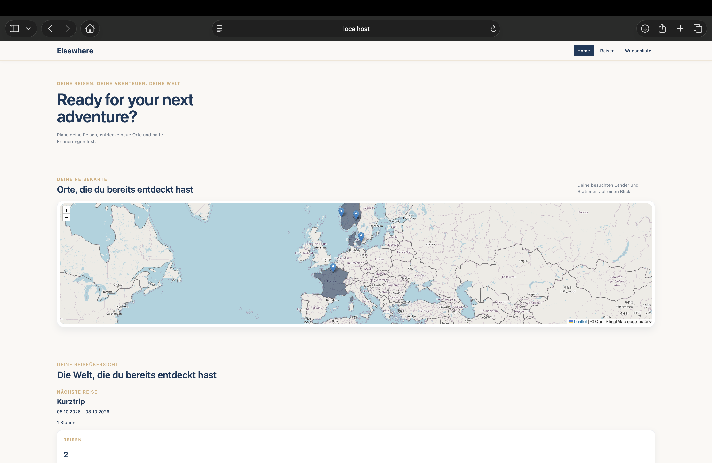
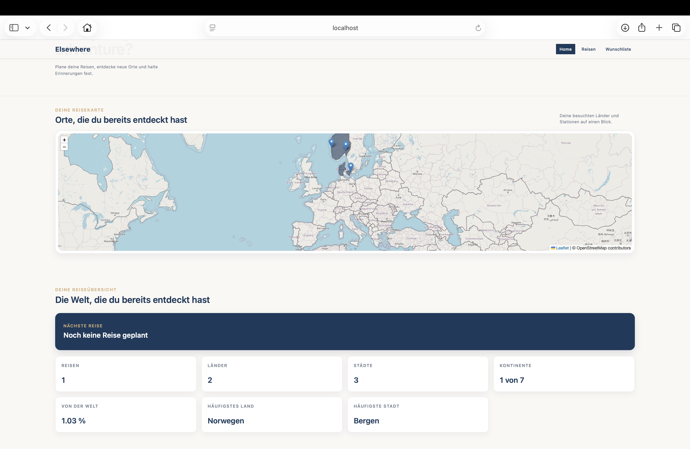
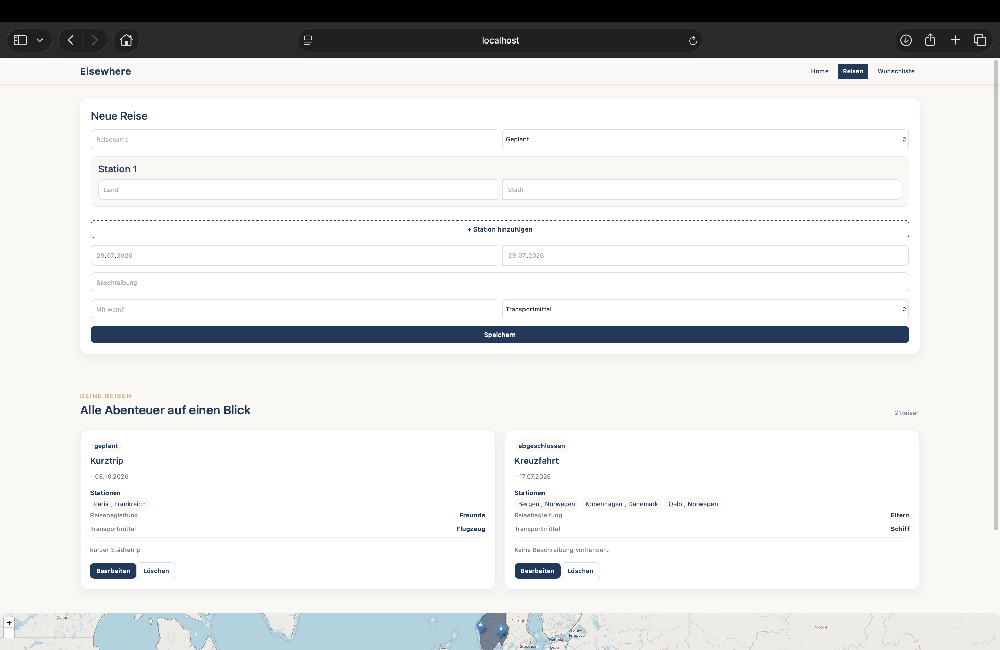
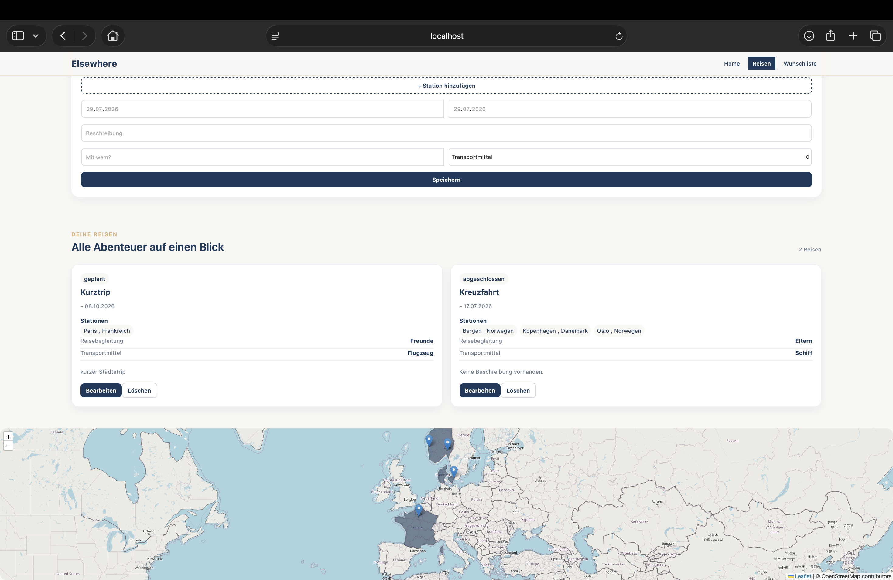
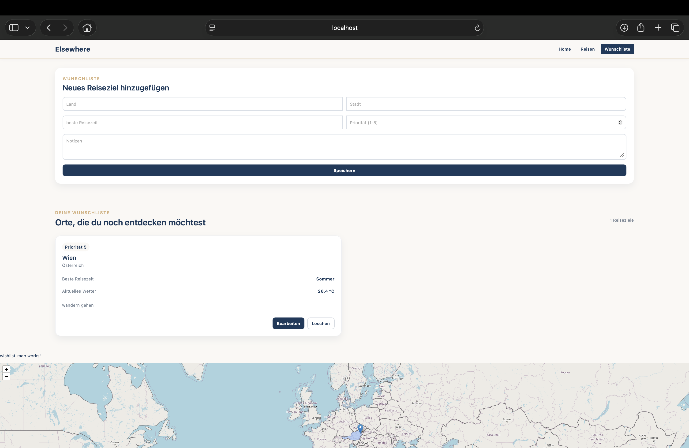

# Elsewhere

## Projektbeschreibung

Elsewhere ist eine Webanwendung zur Planung und Verwaltung von Reisen.

Nutzerinnen und Nutzer können Reisen anlegen, bearbeiten, anzeigen und löschen. Jede Reise kann mehrere Stationen enthalten und wird auf einer interaktiven Weltkarte dargestellt. Zusätzlich können Wunschreiseziele gespeichert, priorisiert und mit Informationen wie Notizen, Reisezeit und Wetter ergänzt werden.

Die Anwendung wurde als Semesterprojekt im Modul Webtechnologien entwickelt.

## Funktionen

### Reisen

- Reisen erstellen
- Reisen bearbeiten
- Reisen löschen
- Reisen anzeigen
- mehrere Stationen pro Reise speichern
- Status einer Reise festlegen
- Reisebegleitung und Transportmittel erfassen
- abgeschlossene Reisen bewerten

### Wunschliste 

- Wunschreiseziele erstellen
- Wunschreiseziele bearbeiten
- Wunschreiseziele löschen
- Prioritäten vergeben
- Notizen speichern
- beste Reisezeit festhalten
- Wetterinformationen anzeigen

### Weltkarte 

- besuchte Länder darstellen
- Reiseziele durch Marker anzeigen
- mehrere Stationen einer Reise berücksichtigen

### Statistiken

- Anzahl besuchter Länder
- Anzahl besuchter Städte
- Anteil bereister Länder weltweit
- häufigstes Reiseziel
- nächste geplante Reise

## Screenshots

### Startseite 




### Reisen




### Wunschliste 



## Verwendete Technologien

### Frontend

- Angular 
- TypeScript
- HTML
- CSS 
- Bootstrap
- Leaflet

### Backend

- Node.js
- Express

### Datenbank

- MongoDB
- Mongoose

### Weitere Schnittstellen

- OpenWeather API
- Geocoding für Kartenpositionen

## Installation

### Voraussetzungen

Für die Ausführung werden benötigt:

- Node.js
- npm
- MongoDB
- das Elsewhere-Backend

### Frontend installieren 

Repository klonen und in den Projektordner wechseln:

```bash
git clone https://github.com/juliax108/elsewhere-frontend
cd elsewhere-frontend
```

Abhängigkeiten installieren:

```bash
npm install
```

Frontend starten:

```bash
ng serve
```

Die Anwendung ist anschließend unter folgender Adresse erreichbar:

```text
http://localhost:4200
```

Damit alle Funktionen verfügbar sind, muss zusätzlich das Backend gestartet werden.

## Bedienung

Über die Navigation können die verschiedenen Bereiche der Anwendung geöffnet werden. 
Im Bereich "Reisen" können neue Reisen angelegt werden und bestehende Einträge bearbeitet oder gelöscht werden. 
Im Bereich "Wunschliste" können zukünftige Reiseziele verwaltet werden. 
Auf der Startseite werden die Weltkarte und verschiedene Reisestatistiken angezeigt.

## Verwendete KI-Werkzeuge

### ChatGPT von OpenAI

ChatGPT wurde unterstützend verwendet für:

- einzelne Fragen zu Angular, TypeScript, HTML und CSS
- Unterstützung bei der Weltkarte mit Leaflet
- Unterstützung bei der Wetterintegration
- Fehlersuche und Debugging
- Hilfe bei der Gestaltung der Benutzeroberfläche


